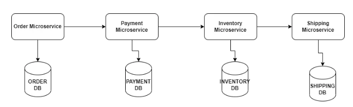
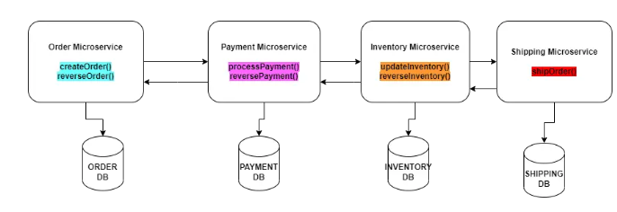

# saga-pattern-choreography
Saga Pattern Choreography in Microservice Using Spring Boot

### How to implement SAGA design pattern in Spring Boot?

Contents:

1. Problem
2. Solution
3. Implementation
4. Code
5. Testing
6. Advantages
7. Disadvantages
8. Conclusion

### Problem:

Microservices come with their own advantages and disadvantages.

One such disadvantage is managing distributed transactions.

Let’s say your transaction spans 4 different microservices.

How do you ensure that your transaction either commits successfully with all the 4 tasks succeeding or fails
successfully if any of the tasks is not completed ( the completed ones are rolled back)?

Spring Boot provides the annotation @Transactional to manage transactions.

But this works only within a single method and within a single project.

### Solution:

There is a design pattern which solves the issue with distributed transactions in microservices.

It was originally proposed by the computer scientist Hector Gracia Molina and Kenneth Salem as mentioned in their
paper [here](https://www.cs.cornell.edu/andru/cs711/2002fa/reading/sagas.pdf).

As suggested in the paper , they created this for Long Lived Transactions (LLT) and not for microservices but it serves
well for microservices.

A long lived transaction is a transaction which takes a longer time , may be minutes , hours or even days. You can’t
lock a database until all the tasks in such transaction completes for it will severely affect the performance of the
application. Hence they came up with the design pattern SAGA (probably named SAGA because they created it for dealing
with long transactions – SAGA means a very long story).

It goes like this :

If your transaction contains , lets say 4 tasks,

You create a **compensating task** for each task except the last.

So that if any task fails then you run the compensating tasks of the previous tasks to rollback the original effect.

So if there are four tasks T1, T2 , T3 and T4,

Then you have three corresponding compensating tasks C1,C2,C3.

If , for example , T1 and T2 succeeds and T3 fails , then you run C2 and C1 to rollback the effects of T1 and T2 in *
*Last In First Out order**.

So the sequence of the transaction goes like this : T1 -> T2 -> T3 (failed) -> C2 -> C1.

You don’t need a compensating task for the last task because if the last task fails you just need to roll back the
previous tasks.

This is called **Backward Recovery** since you go back and execute the compensating tasks of already completed
successful tasks.

You can also try **Forward Recovery** by retrying T3 and then T4 if your business use case requires it.

Backward Recovery is more common though.

On a high level this is what SAGA design pattern is.

It can be implemented in two ways:

* Choreography
* Orchestration
  Choreography means the tasks execute independently. Once one task is completed , it invokes the next tasks in the
  sequence. In case if the next task fails then it invokes the compensating tasks for the previous tasks.

Orchestration means the tasks are invoked by another parent task.

It plays the role of an orchestrator.

It calls each tasks in sequence and based on their response decides whether to call the next task or the compensating
tasks.

Let us implement SAGA using Choreography in this example.

It is simpler and neat compared to Orchestration.

### Implementation:

Let’s consider the example of a ecommerce application.

A customer places an order and the order gets shipped.

This is the business use case.

Let’s say there are four different microservices to take care of this flow.

An order microservice which handles the customer orders.

A payment microservice which handles payments for the orders.

An inventory microservice which updates the inventory once orders are placed.

A shipping microservice which deals with delivering the orders.

Note that in real case , separating these functionalities into four different apps may not be a good design . If your
user base is small you can do all the above in a single monolith instead of four different microservices which is going
to increase your network calls and infrastructure cost. Also handling transactions in a monolith is way more easier.

For this example though , we will go with this design to understand SAGA design pattern.

Now let’s consider the below functions in each microservice when a customer places an order:

1. createOrder() – Oder microservice
2. processPayment() – Payment microservice
3. updateInventory() – Inventory microservice
4. shipOrder() – Shipping Microservice

When a customer places an order and createOrder() , processPayment() methods succeed and updateInventory() method fails
then the system will have a wrong inventory information. And the customer won’t get her order shipped!

So all these tasks have to be part of a single transaction.

You can use SAGA design pattern to implement distributed transaction.

To resolve the above issue , you can rollback the entire transaction using backward recovery.

You can have a compensation task for each of the tasks above.

Here are the compensating tasks

1. reverseOrder() – Order microservice
2. reversePayment() – Payment microservice
3. reverseInventory() – Inventory microservice
   Here is the updated flow:

Now if updateInventory() method fails, then you call reversePayment() and then reverseOrder() and the order will be
rolled back!

### Advantages:

If you want to execute a series of tasks spanning different microservices SAGA helps you achieve it.
SAGA lets you do a transaction in an asynchronous way , this can improve application performance

### Disadvantages:

SAGA makes your code more complex to implement and understand
SAGA only ensures eventual consistency of data so if your transaction has tightly coupled tasks then it is not an option

###Conclusion:
We saw how SAGA can help in implementing distributed transactions with sample code.